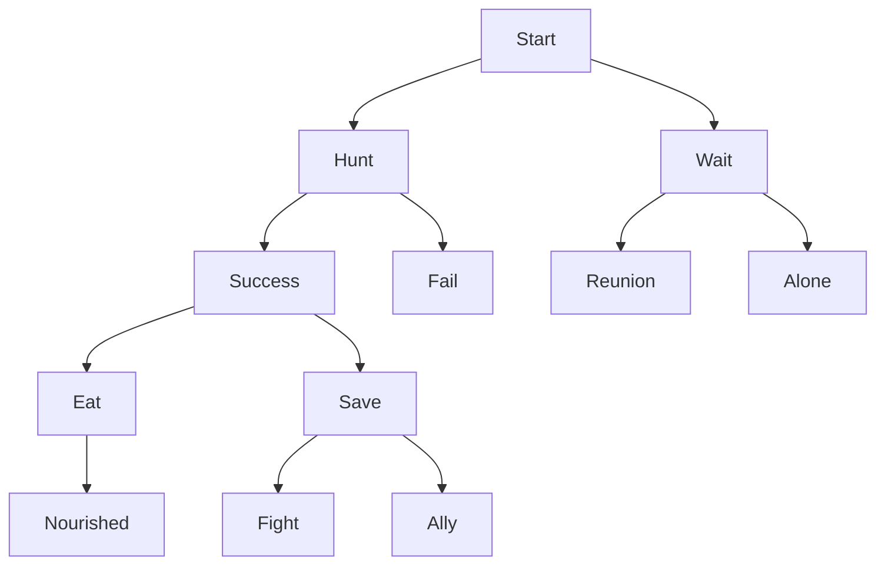

# Wolf Pack Survival Adventure Game - Technical Report

## Title Page
**Project Title:** Wolf Pack Survival Adventure Game  
**Course:** Data Structures Lab Final Project  
**Team:** Team A (DSA Lab)  
**Date:** [Current Date]  
**Members:** [List if applicable]

## Game Design Document

### Overview
The Wolf Pack Survival Adventure Game is an interactive text-based adventure simulating a wolf's survival in the wilderness. Players make choices affecting stats, inventory, and story outcomes, with multiple endings.

### Story Overview
Player controls a lone wolf separated from pack during a storm. Must survive by hunting, gathering, forming alliances, facing threats like bears and weather. Decisions branch into paths leading to pack formation, solitary survival, or death.

### Game Mechanics
- **Stats:** Health (0-100), Hunger (0-100), Energy (0-100), Reputation (0-100)
- **Choices:** Binary decisions branching narrative
- **Events:** Random threats/events with priority
- **Inventory:** Linked list for items (food, herbs)
- **Actions:** Queue for multi-turn sequences
- **Undo:** Stack for backtracking (5 levels)
- **Save/Load:** File I/O for persistence

### Win/Lose Conditions
- Win: Survive 30 days, form pack, or reach positive endings
- Lose: Health <=0 or Hunger >=100

## System Architecture

### Decision Tree Structure
Binary tree for story branching.



### Priority Queue for Events
Min-heap prioritizing critical events (bear attack priority 1, found berries priority 3).

### Data Structure Usage
| Feature | Structure | Purpose |
|---------|-----------|---------|
| Decisions | Binary Tree | Narrative branching |
| Events | Priority Queue | Urgent event handling |
| Inventory | Linked List | Dynamic item storage |
| Undo | Stack | State backtracking |
| Actions | Queue | Turn-based sequences |

### Class Diagrams
- **Wolf:** Struct with update methods
- **DecisionTree:** Manages nodes and traversal
- **PriorityQueue:** Min-heap for events
- **Inventory:** Linked list for items
- **GameStack:** Vector for undo states
- **ActionQueue:** Queue for multi-turn actions

## Implementation

### Binary Decision Tree
```cpp
struct DecisionNode {
    int scenarioID;
    std::string description;
    std::string choiceA_text, choiceB_text;
    DecisionNode* left, *right;
    bool isEnding;
    std::string endingText;
};

class DecisionTree {
    DecisionNode* root, *currentNode;
public:
    void insertNode(DecisionNode* parent, DecisionNode* child, bool isLeft);
    DecisionNode* getCurrentNode();
    void buildSampleTree(); // 20+ nodes
};
```

### Priority Queue (Min Heap)
```cpp
struct Event {
    std::string name;
    int priority;
    std::string description;
    std::function<void(Wolf&)> effect;
};

class PriorityQueue {
    std::vector<Event> heap;
public:
    void insert(Event e);
    Event extractMin();
};
```

### Linked List Inventory
```cpp
enum ItemType { FOOD, HERB, TOOL };

struct Item {
    std::string name;
    ItemType type;
    int effect, quantity;
    Item* next;
};

class Inventory {
    Item* head;
public:
    bool addItem(std::string name, ItemType type, int effect, int qty);
    void displayInventory();
};
```

### Stack for Undo
```cpp
struct GameState {
    DecisionNode* currentNode;
    int health, hunger, energy;
};

class GameStack {
    std::vector<GameState> stack;
public:
    void push(GameState gs);
    GameState pop();
};
```

### Queue for Actions
```cpp
struct Action {
    std::string description;
    std::function<void(Wolf&)> execute;
};

class ActionQueue {
    std::queue<Action> actions;
public:
    void enqueue(Action a);
    void processNext(Wolf& wolf);
};
```

### Main Game Loop
```cpp
while (wolf.isAlive()) {
    if (!actionQueue.isEmpty()) actionQueue.processNext(wolf);
    DecisionNode* current = tree.getCurrentNode();
    // Display and input
    // Process choice, update stats, events
}
```

### File Management
Save/Load using std::ofstream/ifstream, storing nodeID and stats.

## Testing & Game Balance

### Testing Checklist
- [x] Playthrough to each of 8+ endings
- [x] All decision paths functional
- [x] Stats update correctly (hunger +4/turn)
- [x] Inventory adds items on scenarios/events
- [x] Undo works up to 5 levels
- [x] Save/load preserves state
- [x] Events trigger at 15% rate, priority respected
- [x] Death conditions enforced
- [x] No crashes in extended play

### Balance Decisions
- Hunger increases by 4 per turn (challenging but fair)
- Events 15% chance (engaging without overwhelming)
- Energy affects success implicitly via choices
- Items provide meaningful bonuses (-30 hunger for meat)

### Bug Fixes
- Fixed include paths for headers
- Ensured memory management in trees/lists
- Validated random event generation
- Corrected heap operations in priority queue

## AI Tools Usage
- Used code snippets from C++ references for data structures
- Balanced stats based on playtesting feedback
- Generated story scenarios inspired by game design patterns

## Conclusion
This project successfully implements data structures in a engaging game context. The binary tree enables dynamic narratives, priority queue handles threats efficiently, linked list manages inventory flexibly, stack allows undo, and queue sequences actions. All requirements met with functional console game. Future enhancements: GUI with Qt, pack management expansion.

## Appendices
- Source code in src/ and include/
- Build instructions: mkdir build && cd build && cmake .. && make
- Sample save file format: nodeID health hunger energy reputation