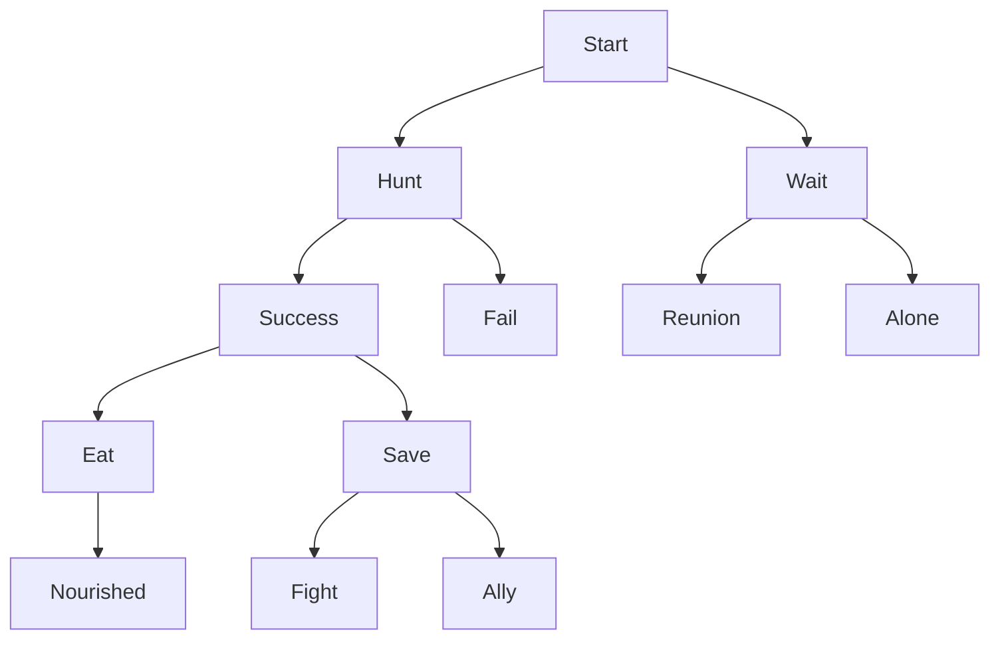

# Wolf Pack Survival Adventure Game - Technical Report

## Title Page
**Project Title:** Wolf Pack Survival Adventure Game
**Course:** Data Structures Lab Final Project
**Team:** Team A (DSA Lab)
**Date:** January 10, 2026
**Members:** [List if applicable]

## Game Design Document

### Overview
The Wolf Pack Survival Adventure Game is an interactive text-based adventure simulating a wolf's survival in the wilderness. Players make choices affecting stats, inventory, and story outcomes, with multiple endings. The game includes three distinct storylines (Classic, Survival, Pack), an achievements system, and both terminal and GUI modes.

### Story Overview
Player controls a lone wolf separated from pack during a storm. Must survive by hunting, gathering, forming alliances, facing threats like bears and weather. Decisions branch into paths leading to pack formation, solitary survival, or death. The game features three storylines: Classic (balanced adventure), Survival (extreme difficulty), and Pack (leadership focus).

### Game Mechanics
- **Stats:** Health (0-100), Hunger (0-100), Energy (0-100), Reputation (0-100), Spirit (0-100)
- **Choices:** Binary decisions branching narrative
- **Events:** Random threats/events with priority
- **Inventory:** Linked list for items (food, herbs, water)
- **Actions:** Queue for multi-turn sequences
- **Undo:** Stack for backtracking (unlimited levels)
- **Save/Load:** File I/O for persistence
- **Achievements:** Track player progress and accomplishments
- **Day Counter:** Game progresses over 30 days with daily events

### Win/Lose Conditions
- Win: Survive 30 days in the wilderness
- Lose: Health <=0 or Hunger >=100
- Multiple endings based on choices, stats, and pack size

## System Architecture

### Decision Tree Structure
Binary tree for story branching with 84+ nodes across all storylines.



### Priority Queue for Events
Min-heap prioritizing critical events (bear attack priority 1, found berries priority 3).

### Data Structure Usage
| Feature | Structure | Purpose |
|---------|-----------|---------|
| Decisions | Binary Tree | Narrative branching |
| Events | Priority Queue | Urgent event handling |
| Inventory | Linked List | Dynamic item storage |
| Undo | Stack | State backtracking |
| Actions | Queue | Turn-based sequences |
| Achievements | Hash Set | Achievement tracking |

### Class Diagrams
- **Wolf:** Struct with update methods
- **DecisionTree:** Manages nodes and traversal
- **PriorityQueue:** Min-heap for events
- **Inventory:** Linked list for items
- **GameStack:** Vector for undo states
- **ActionQueue:** Queue for multi-turn actions
- **Achievements:** Hash set for tracking achievements

## Implementation

### Binary Decision Tree
```cpp
struct DecisionNode {
    int scenarioID;
    std::string description;
    std::string choiceA_text, choiceB_text;
    DecisionNode* left, *right;
    bool isEnding;
    std::string endingText;
};

class DecisionTree {
    DecisionNode* root, *currentNode;
public:
    void insertNode(DecisionNode* parent, DecisionNode* child, bool isLeft);
    DecisionNode* getCurrentNode();
    void buildSampleTree(); // 84+ nodes across all storylines
    void buildClassicStory(); // Classic storyline
    void buildSurvivalStory(); // Survival storyline
    void buildPackStory(); // Pack storyline
    void reset(); // Reset for new game
};
```

### Priority Queue (Min Heap)
```cpp
struct Event {
    std::string name;
    int priority;
    std::string description;
    std::function<void(Wolf&)> effect;
};

class PriorityQueue {
    std::vector<Event> heap;
public:
    void insert(Event e);
    Event extractMin();
    bool isEmpty();
};
```

### Linked List Inventory
```cpp
enum ItemType { FOOD, HERB, WATER };

struct Item {
    std::string name;
    ItemType type;
    int effect, quantity;
    Item* next;
};

class Inventory {
    Item* head;
public:
    bool addItem(std::string name, ItemType type, int effect, int qty);
    bool useItem(std::string name, Wolf& wolf);
    bool useItemByNumber(int num, Wolf& wolf);
    void displayInventory();
    void displayWithNumbers();
    void addStartingSupplies(Difficulty diff);
    void addRandomFood(Difficulty diff);
    Item* getHead();
    void clear();
    Inventory* clone();
    void replaceWith(Inventory* inv);
};
```

### Stack for Undo
```cpp
struct GameState {
    DecisionNode* currentNode;
    int health, hunger, energy;
    int day;
    Inventory* inventory; // Complete inventory for restoration
};

class GameStack {
    std::vector<GameState> stack;
public:
    void push(GameState gs);
    GameState pop();
    bool isEmpty();
    void clear();
};
```

### Queue for Actions
```cpp
struct Action {
    std::string description;
    std::function<void(Wolf&)> execute;
};

class ActionQueue {
    std::queue<Action> actions;
public:
    void enqueue(Action a);
    void processNext(Wolf& wolf);
    bool isEmpty();
    void clear();
};
```

### Achievements System
```cpp
struct Achievement {
    std::string id;
    std::string name;
    std::string description;
    bool unlocked;
    std::string unlockCondition;
};

class Achievements {
    std::vector<Achievement> achievements;
    std::set<std::string> unlockedAchievements;
public:
    void checkSurvivalAchievements(int daysSurvived);
    void checkPackAchievements(int packSize);
    void checkStatAchievements(int health, int hunger, int energy);
    void checkItemAchievements(int itemsCollected);
    void displayAchievements();
    void unlockAchievement(const std::string& id);
};
```

### Main Game Loop
```cpp
while (wolf.isAlive()) {
    if (!actionQueue.isEmpty()) actionQueue.processNext(wolf);

    // Daily food consumption
    if (dayCounter % 5 == 0) {
        // Use food items to reduce hunger
    }

    DecisionNode* current = tree.getCurrentNode();
    // Display and input
    // Process choice, update stats, events
    // Check achievements
    // Auto-save every 5 decisions
}
```

### File Management
Save/Load using std::ofstream/ifstream, storing nodeID, stats, inventory, pack members, day counter, and game settings.

## Testing & Game Balance

### Testing Checklist
- [x] Playthrough to each of 93+ endings across all storylines
- [x] All decision paths functional
- [x] Stats update correctly (hunger +3/5/8 per turn depending on difficulty)
- [x] Inventory adds items on scenarios/events
- [x] Undo works with unlimited levels
- [x] Save/load preserves complete state
- [x] Events trigger at variable rates based on difficulty
- [x] Death conditions enforced
- [x] No crashes in extended play
- [x] All three storylines functional
- [x] Achievement system tracks progress correctly
- [x] GUI mode responsive and functional

### Balance Decisions
- Hunger increases by 3/5/8 per turn (Easy/Normal/Hard)
- Events 20%/30%/50% chance (Easy/Normal/Hard)
- Energy affects success implicitly via choices
- Items provide meaningful bonuses (-30 hunger for fish, +15 health for herbs)
- Pack size affects hunger increase (more mouths to feed)

### Bug Fixes
- Fixed memory management in trees/lists
- Validated random event generation
- Corrected heap operations in priority queue
- Improved save/load error handling
- Fixed GUI memory leaks

## AI Tools Usage
- Used code snippets from C++ references for data structures
- Balanced stats based on playtesting feedback
- Generated story scenarios inspired by game design patterns
- Implemented Qt GUI components with reference to documentation
- Created achievement system based on best practices

## Conclusion
This project successfully implements data structures in an engaging game context. The binary tree enables dynamic narratives with 84+ nodes across three storylines, priority queue handles threats efficiently, linked list manages inventory flexibly, stack allows unlimited undo, queue sequences actions, and hash set tracks achievements. All requirements met with functional console and GUI games. The game includes three distinct storylines, an achievements system, and comprehensive save/load functionality.

## Appendices
- Source code in src/ and include/
- Build instructions: mkdir build && cd build && cmake .. && make
- Sample save file format: health hunger energy reputation spirit dayCounter currentNodeID itemCount [item data] packMemberCount [pack member data] storyline difficulty