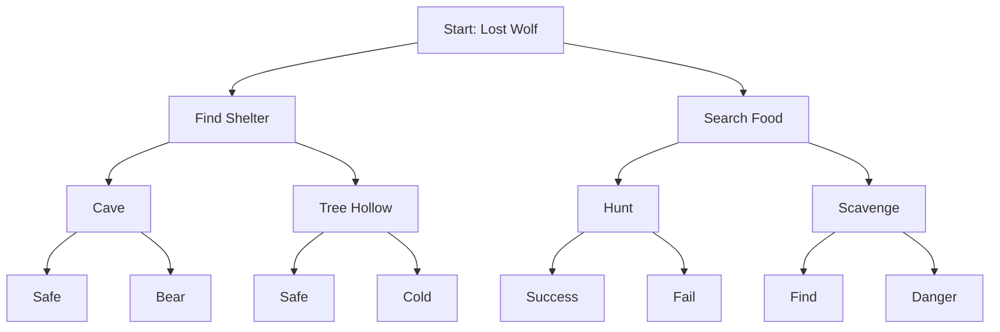

# Wolf Pack Survival Adventure Game - Implementation Plan

## 1. Project Overview & Setup

### Game Summary
The Wolf Pack Survival Adventure Game is an interactive text-based adventure where players control a lone wolf navigating a dangerous wilderness. The game features story-driven decisions, resource management, combat encounters, and pack dynamics, with multiple endings based on choices.

**Key Objectives:**
- Survive 30 days in the wilderness
- Maintain stats: Hunger, Health, Energy, Reputation
- Make decisions that affect story outcomes
- Collect resources and build a pack

### Why This Project?
- Highly engaging and creative
- Uses data structures in unique gaming contexts
- Combines logic with creativity
- Fun to build and test!

### Team Structure (8-10 Members)
- **Team Leader (1)**: Coordinate modules, oversee story integration, manage testing, final QA
- **LaTeX Report Specialist (1)**: Document game design, create technical report, include flowcharts
- **Core Developers (6-8)**:
  - Module 1: Story & Decision System (2) - Decision trees, narrative branching
  - Module 2: Character & Inventory (2) - Stats management, linked list inventory
  - Module 3: Combat & Events (2) - Priority queue for threats, event system
  - Module 4: GUI & Game Loop (2) - Interface, save/load system

### Learning Objectives
- Implement binary trees for decision-based narratives
- Use priority queues for threat management
- Apply stacks for undo functionality
- Use linked lists for dynamic inventory
- Build interactive GUI with Dear ImGui/Qt

### Technical Requirements
- **Language**: C++ (C++11 or higher)
- **GUI**: Dear ImGui or Qt
- **Random Events**: C++ <random> library
- **Build Tools**: CMake or Makefile

### Project Duration: 7 Days
- Day 1: Story Design & Setup
- Days 2-3: Core Systems Implementation
- Days 4-5: Integration & Game Loop
- Day 6: Content & Balancing
- Day 7: Documentation & Demo

### Environment Setup
1. Install Dear ImGui: Clone from https://github.com/ocornut/imgui, follow build instructions
2. For Qt: Install Qt Creator and Qt5/6 libraries
3. Include headers for <random>, <iostream>, etc.
4. Sample project structure:
```
src/
├── main.cpp
├── wolf.h/cpp
├── inventory.h/cpp
├── decision_tree.h/cpp
├── priority_queue.h/cpp
├── stack.h/cpp
├── gui.h/cpp
├── scenarios.txt
```

### Risks & Common Pitfalls
- Too complex story: Start with 10 nodes, expand to 20
- Unbalanced gameplay: Test stat changes thoroughly
- Poor GUI readability: Ensure text is clear and large
- Not testing paths: Play every branch!

## 2. Data Structures Foundation

### Required Data Structures
| Feature | Data Structure | Why? |
|---------|----------------|------|
| Story Decisions | Binary Tree | Branch based on choices |
| Threat Management | Min Heap Priority Queue | Critical events first |
| Inventory | Singly Linked List | Dynamic item storage |
| Pack Members | Singly Linked List | Variable pack size |
| Game History (Undo) | Stack | LIFO for backtracking |
| Action Sequences | Queue | FIFO for multi-turn actions |

### Binary Decision Tree
**Node Structure:**
```cpp
struct DecisionNode {
    int scenarioID;
    std::string description;
    std::string choiceA_text;
    std::string choiceB_text;
    DecisionNode* left;  // Choice A
    DecisionNode* right; // Choice B
    bool isEnding;       // True for leaf nodes
    std::string endingText; // For endings
};
```

**Functions:**
- `insert()`: Add nodes recursively
- `traverse()`: Navigate based on choices
- `getCurrentChoices()`: Return choice texts

**Sample Tree Building:**
```cpp
DecisionNode* root = new DecisionNode{1, "You wake up alone...", "Hunt", "Wait", nullptr, nullptr, false, ""};
root->left = new DecisionNode{2, "You find prey...", "Attack", "Stalk", nullptr, nullptr, false, ""};
// Add more nodes...
```

**Mermaid Diagram:**


### Priority Queue (Min Heap for Events)
**Event Structure:**
```cpp
struct Event {
    std::string name;
    int priority; // 1-3, lower is urgent
    std::string description;
    std::function<void(Wolf&)> effect; // Lambda for stat changes
};
```

**Min Heap Implementation:**
```cpp
class PriorityQueue {
    std::vector<Event> heap;
public:
    void insert(Event e);
    Event extractMin();
    bool isEmpty();
};
```

**Example Usage:**
```cpp
PriorityQueue events;
events.insert({"Bear Attack", 1, "A bear approaches!", [](Wolf& w){ w.health -= 20; }});
events.insert({"Found Berries", 3, "You spot edible berries.", [](Wolf& w){ w.hunger -= 10; }});
// Process: extractMin() returns highest priority first
```

### Singly Linked List (Inventory & Pack)
**Item Structure:**
```cpp
enum ItemType { FOOD, HERB, TOOL };
struct Item {
    std::string name;
    ItemType type;
    int effect; // e.g., -30 hunger for food
    int quantity;
    Item* next;
};
```

**Functions:**
```cpp
class Inventory {
    Item* head;
public:
    void addItem(std::string name, ItemType type, int effect, int qty);
    bool useItem(std::string name, Wolf& wolf);
    void displayInventory();
    bool isFull(); // Max 10 items
};
```

**Sample:**
```cpp
Inventory inv;
inv.addItem("Rabbit Meat", FOOD, -30, 1);
inv.useItem("Rabbit Meat", wolf); // Applies effect, removes item
```

### Stack (Game History for Undo)
**GameState Structure:**
```cpp
struct GameState {
    int nodeID;
    int health, hunger, energy;
    Item* inventoryHead;
    int day;
};
```

**Stack Implementation:**
```cpp
class GameStack {
    std::vector<GameState> states;
public:
    void push(GameState gs);
    GameState pop();
    bool isEmpty();
    int size(); // Max 5
};
```

### Queue (Action Sequences)
**Action Structure:**
```cpp
struct Action {
    std::string description;
    std::function<void(Wolf&)> execute;
};
```

**Queue Implementation:**
```cpp
class ActionQueue {
    std::queue<Action> actions;
public:
    void enqueue(Action a);
    void processNext(Wolf& wolf);
    bool isEmpty();
};
```

## 3. Core Game Systems

### Story & Decision System
- Minimum 20 decision nodes, 5 endings
- Track player path through tree
- Display current scenario and choices

**Integration Code:**
```cpp
void processDecision(Wolf& wolf, DecisionTree& tree, char choice) {
    // Save state
    gameHistory.push(currentState);
    // Move in tree
    currentNode = (choice == 'A') ? currentNode->left : currentNode->right;
    // Update stats (e.g., hunger increases)
    wolf.hunger += 5;
    if (wolf.hunger > 80) wolf.health -= 10;
    // Check events
    checkRandomEvents();
    dayCounter++;
}
```

### Wolf Stats Management
```cpp
struct Wolf {
    int health = 100; // 0-100, dies at 0
    int hunger = 0;   // 0-100, dies if 100
    int energy = 100; // 0-100, affects success
    int reputation = 0; // 0-100, for pack
};
```

**Validation:**
```cpp
bool canMakeChoice(const Wolf& wolf, int energyReq) {
    return wolf.energy >= energyReq && wolf.health > 0 && wolf.hunger < 100;
}
```

### Inventory System
- Store items with effects
- Linked list for dynamic size

**Example Items:**
- Rabbit Meat: Reduces hunger by 30
- Healing Herbs: Restores 20 health
- Territory Map: Reveals paths

### Event System
- Random events based on decisions/time
- Priority queue for urgent threats

**Event Processing:**
```cpp
void checkEvents(PriorityQueue& events, Wolf& wolf) {
    if (!events.isEmpty()) {
        Event e = events.extractMin();
        e.effect(wolf); // Apply stat changes
        std::cout << e.description << std::endl;
    }
}
```

### Pack Management (Optional)
- Recruit wolves: Name, Role, Loyalty
- Benefits: Hunting boost, protection

**Linked List for Pack:**
```cpp
struct PackMember {
    std::string name;
    std::string role; // Hunter, Scout, Guard
    int loyalty;
    PackMember* next;
};
```

### Game State History
- Save before decisions, undo up to 5 levels

## 4. GUI & User Interface

### Window Structure
- Top: Status Panel (Health/Hunger/Energy bars, Day, Weather)
- Middle: Story Display (Scrollable text)
- Bottom: Choice Buttons (2-4 buttons, disabled if invalid)

### Dear ImGui Setup
```cpp
#include "imgui.h"
// In main loop:
ImGui::Begin("Wolf Game");
ImGui::Text("Health: %d", wolf.health);
// Add buttons for choices
if (ImGui::Button("Hunt")) processDecision('A');
ImGui::End();
```

### Panels
- Inventory Button: Opens list with use options
- Undo Button: Pops stack, restores state
- Save/Load: File I/O

## 5. Game Loop & Integration

### Main Loop Pseudo-Code
```cpp
int main() {
    Wolf wolf;
    DecisionTree tree = buildTree();
    PriorityQueue events;
    GameStack history;
    ActionQueue actions;
    GUI gui;

    while (!gameOver) {
        gui.displayStory(currentNode);
        gui.displayStats(wolf);
        char choice = gui.getChoice();
        processDecision(wolf, tree, choice);
        checkEvents(events, wolf);
        if (randomEncounter()) triggerEvent(events);
        if (wolf.health <= 0 || wolf.hunger >= 100) gameOver = true;
    }
}
```

### Validation & Checks
- Cannot choose without energy
- Cannot use non-existent items
- Death conditions enforced

## 6. Content & Balancing

### Sample Scenarios
- **Beginning**: "You wake up alone... Choice A: Hunt, Choice B: Wait"
- **Hunt**: "You track prey... Choice A: Attack, Choice B: Stalk"
- Endings: Alpha Wolf, Lone Wanderer, Tragic Death

### Balancing
- Adjust stat changes (e.g., hunger +5 per decision)
- Tune event chances (e.g., 10% encounter rate)
- Playtest for winnability

## 7. Testing, Debugging & Validation

### Checklist
- [ ] Playthrough to each ending
- [ ] Test all paths
- [ ] Verify stats affect choices
- [ ] Test inventory ops
- [ ] Test undo (5 levels)
- [ ] Test save/load
- [ ] Events trigger correctly
- [ ] Death conditions
- [ ] Pack recruitment

### Debugging Tips
- Use asserts for stat ranges
- Log decisions for branching issues

## 8. Deliverables & Documentation

### LaTeX Report
- Title page, Game Design, System Architecture, Implementation, Testing, Conclusion

### Demo Video
- Show start, decisions, inventory, events, undo, ending, save/load

### Submission
- Source code, report, video by deadline

### Bonus Points
- ASCII art, multiple saves, achievements, sound effects